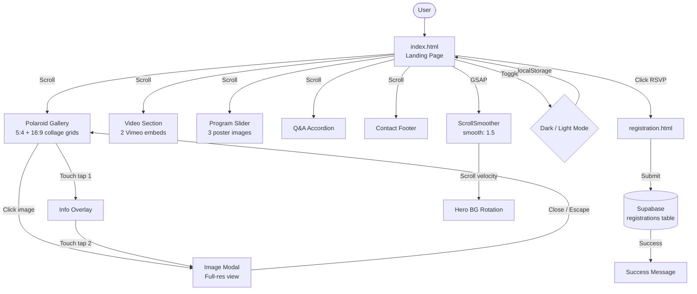
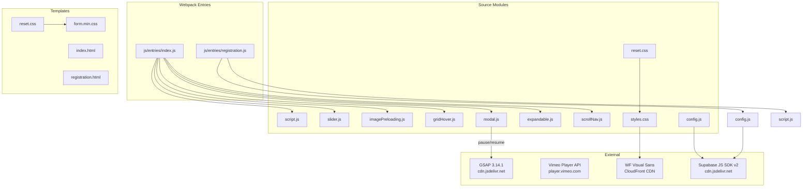
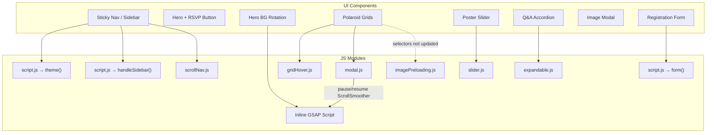

# *Event Website* project

A static event website for student Christian fellowship group. Promotes the spring student retreat _"Falling in Love with Jesus"_ with a photo-rich landing page, smooth-scrolling animations, and a Supabase-backed registration form.

**Live site**: [drincatuic.org](https://drincatuic.org)

## Demo

https://github.com/user-attachments/assets/9df883d5-5220-47a6-8a07-66a975d0f0c5

## Architecture



## Features

- **Dark/Light mode** Toggle saved to `localStorage`; token-based CSS theming with zero per-component overrides
- **Polaroid collage gallery** Scattered rotation via `nth-child(6n+X)`, hover straightening + shadow depth, fullscreen modal viewer
- **GSAP smooth scrolling** ScrollSmoother for buttery page scroll, scroll-driven hero background rotation via ScrollTrigger
- **Directional hover effects** Mouse-direction-aware overlay animations (inspired by Hakim El Hattab)
- **Touch-optimized** Two-tap interaction (tap 1 = overlay, tap 2 = modal), hamburger sidebar, touch-device CSS class
- **Registration form** Client-side validation, Supabase insert, loading states, personalized success message
- **Responsive-first** Fluid typography via `clamp()`/`min()`/`max()`, mobile breakpoints at 768px/480px
- **Performance** Tiered image preloading, `loading="lazy"`, `content-visibility: auto`, `decoding="async"`, `requestAnimationFrame` guard, `passive` scroll listeners
- **Security hardened** Content-Security-Policy, X-Frame-Options, X-Content-Type-Options, Permissions-Policy, strict referrer policy
- **Frosted glass UI** `backdrop-filter: blur()` with SVG filter fallback on nav, buttons, and panels

## Tech Stack



| Dependency | Purpose |
|---|---|
| Vanilla HTML5 / CSS3 / ES6+ | Core |
| Webpack 5 + Babel Loader | Bundle and compile JS modules |
| [Supabase JS v2](https://supabase.com/docs/reference/javascript) | Registration form backend |
| [GSAP 3.14.1](https://greensock.com/gsap/) | ScrollSmoother + ScrollTrigger for smooth scrolling and scroll-driven animations |
| [Vimeo Player API](https://developer.vimeo.com/) | Embedded event videos |
| WF Visual Sans | Variable web font (woff2) |
| GitHub Pages | Static hosting via CNAME |

JS modules are bundled through webpack entries with `runtimeChunk` manifest extraction and production content-hashed outputs.

## Build with Webpack

```bash
npm install
npm run build
```

Before local builds, create a `.env` file from `.env.example` and set:

- `SUPABASE_URL`
- `SUPABASE_PUBLIC_KEY`

For local development:

```bash
npm start
```

Webpack outputs built files to `dist/` and generates both pages from templates:

- `index.html` using the `index` entry
- `registration.html` using the `registration` entry

## Project Structure

```
.
├── index.html              # Landing page
├── registration.html       # Registration form
├── css/
│   ├── reset.css           # Modified Eric Meyer reset
│   ├── styles.css          # Main page styles
│   ├── styles.min.css      # Minified variant
│   ├── form.css            # Registration form styles
│   └── form.min.css        # Minified variant
├── js/
│   ├── script.js           # Theme, form handler, sidebar
│   ├── config.js           # Supabase client init
│   ├── slider.js           # Image carousel
│   ├── imagePreloading.js  # Progressive image loading
│   ├── gridHover.js        # Directional hover effects
│   ├── modal.js            # Fullscreen image viewer
│   ├── expandable.js       # Accordion Q&A
│   ├── scrollNav.js        # Scroll-responsive navbar
│   └── *.min.js            # Minified variants
├── images/                 # Thumbnails (Small) + originals/
└── assets/                 # Hero BGs, RSVP letter images, favicon
```

## JS Module Map



## License

MIT
