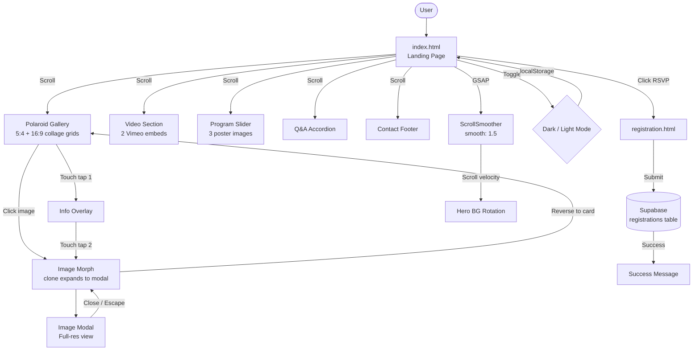
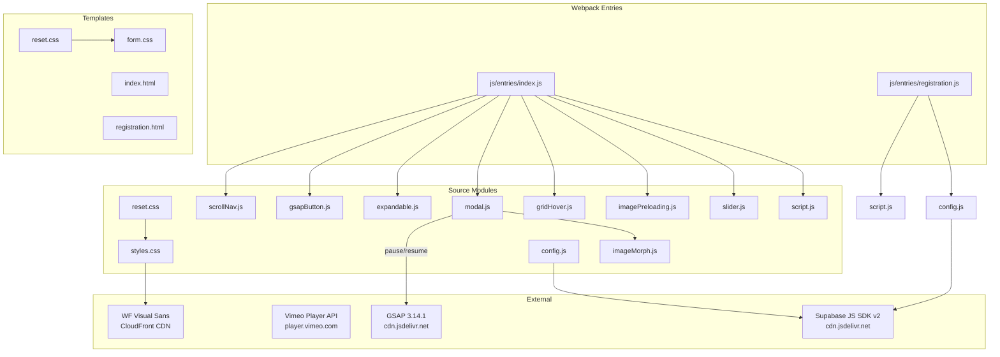
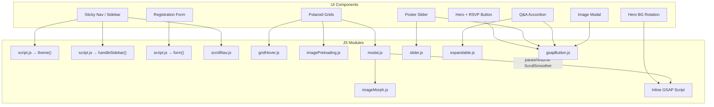

# *Event Website* project

A static event website for a student Christian fellowship group. It promotes the spring student retreat *"Falling in Love with Jesus"* with a photo-rich landing page, smooth-scrolling animations, and a Supabase-backed registration form.

**Live site**: [https://hoangngo-sudo.github.io/drincatuic/](https://hoangngo-sudo.github.io/drincatuic/)

## Demo

https://github.com/user-attachments/assets/c1d8c17d-84f0-4fb1-946d-6861c6eb0c1a

## Architecture



## Features

- **Dark/Light mode**: Toggle saved to `localStorage`; token-based CSS theming with zero per-component overrides
- **Polaroid collage gallery**: Scattered rotation via `nth-child(6n+X)`, hover straightening + shadow depth, fullscreen modal viewer
- **Image morph modal**: GSAP-driven directional morph — a clone of the clicked polaroid expands into the fullscreen modal and retraces its path (tilt + corner radius intact) on close, with distance-aware duration and no crossfade
- **GSAP smooth scrolling**: ScrollSmoother for smooth page scrolling, scroll-driven hero background rotation via ScrollTrigger
- **Directional hover effects**: Mouse-direction-aware overlay animations (inspired by Hakim El Hattab)
- **Touch-optimized**: Two-tap interaction (tap 1 = overlay, tap 2 = modal), touch press feedback on polaroid cards, hamburger sidebar, touch-device CSS class
- **Registration form**: Client-side validation, Supabase insert, loading states, personalized success message
- **Responsive-first**: Fluid typography via `clamp()`/`min()`/`max()`, mobile breakpoints at 768px/480px
- **Performance**: Tiered image preloading with background JPEG decode (the full-res bitmap is ready before the morph starts), static `backdrop-filter` during the morph (no per-frame blur tween), `loading="lazy"`, `content-visibility: auto`, `decoding="async"`, `requestAnimationFrame` guard, `passive` scroll listeners
- **Security hardened**: Content-Security-Policy, X-Frame-Options, X-Content-Type-Options, Permissions-Policy, strict referrer policy
- **Frosted glass UI**: `backdrop-filter: blur()` with SVG filter fallback on nav, buttons, and panels

## Tech Stack



| Dependency | Purpose |
|---|---|
| Vanilla HTML5 / CSS3 / ES6+ | Core |
| Webpack 5 | JS module bundling, chunking, and template injection |
| [Supabase JS v2](https://supabase.com/docs/reference/javascript) | Registration form backend |
| [GSAP 3.14.1](https://greensock.com/gsap/) | ScrollSmoother + ScrollTrigger for smooth scrolling and scroll-driven animations |
| [Vimeo Player API](https://developer.vimeo.com/) | Embedded event videos |
| WF Visual Sans | Variable web font (woff2) |
| GitHub Pages | Static hosting via CNAME |

JS modules are bundled through webpack entries with `runtimeChunk` manifest extraction and production content-hashed outputs. The Content-Security-Policy meta tag is dynamically generated via webpack's `HtmlWebpackPlugin` template parameters. Development builds include `localhost:*` for HMR. Production builds omit it.

## Build with Webpack

```bash
pnpm install
pnpm run build
```

Before local builds, create a `.env` file from `.env.example` and set:

- `SUPABASE_URL`
- `SUPABASE_PUBLIC_KEY`

For local development:

```bash
pnpm start
```

Webpack outputs built files to `dist/` and generates both pages from templates:

- `index.html` using the `index` entry
- `registration.html` using the `registration` entry

## Project Structure

```
.
├── index.html              # Landing page
├── registration.html       # Registration form
├── css/
│   ├── reset.css           # Modified Eric Meyer reset
│   ├── styles.css          # Main page styles
│   └── form.css            # Registration form styles
├── js/
│   ├── script.js           # Theme, form handler, sidebar
│   ├── config.js           # Supabase client init
│   ├── slider.js           # Image carousel
│   ├── imagePreloading.js  # Preload + pre-decode full-res images
│   ├── imageMorph.js       # Directional morph open/close for the modal
│   ├── gridHover.js        # Directional hover effects + touch press
│   ├── modal.js            # Fullscreen image viewer
│   ├── expandable.js       # Accordion Q&A
│   ├── gsapButton.js       # GSAP-driven button hover/tap animations
│   ├── scrollNav.js        # Scroll-responsive navbar
├── images/                 # Thumbnails (Small) + originals/
└── assets/                 # Hero BGs, RSVP letter images, favicon
```

## JS Module Map



## License

MIT
